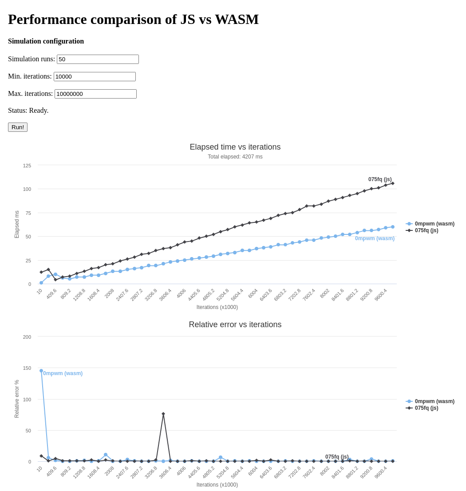

# JS vs WASM performance analysis

This analysis attempts to compare the performance of JavaScript against WebAssembly when running a large number of iterations of an O(n) algorithm.

The algorithm consists of a method of minimising a simple objective function (paraboloid) using the Monte Carlo technique. The method was implemented in JavaScript and C++, and the generated WebAssembly code was compiled with Emscripten.

Check the live version [here](https://js-vs-wasm.github.io).



## Instructions
These are the steps to follow to compile and execute 

1.- Download and install Emscripten.
```bash
git clone https://github.com/emscripten-core/emsdk.git
cd emsdk
./emsdk install latest
./emsdk activate latest
source ./emsdk_env.sh
```

2.- Download and run this repo
```bash
cd ..
git clone https://github.com/matiasmicheletto/js-vs-wasm.git
cd js-vs-wasm-git
chmod 777 ./build.sh # Check the code before running this
./build.sh
npm install -g http-server # Omit if already installed
http-server # Open localhost:8080 on your browser
```
